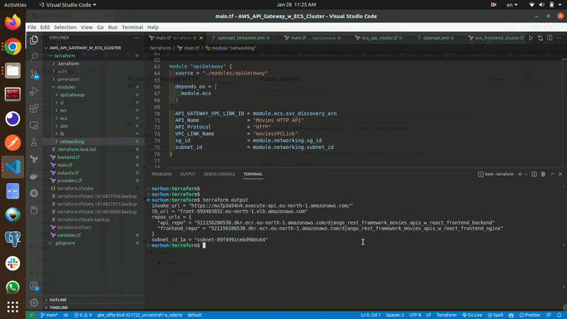
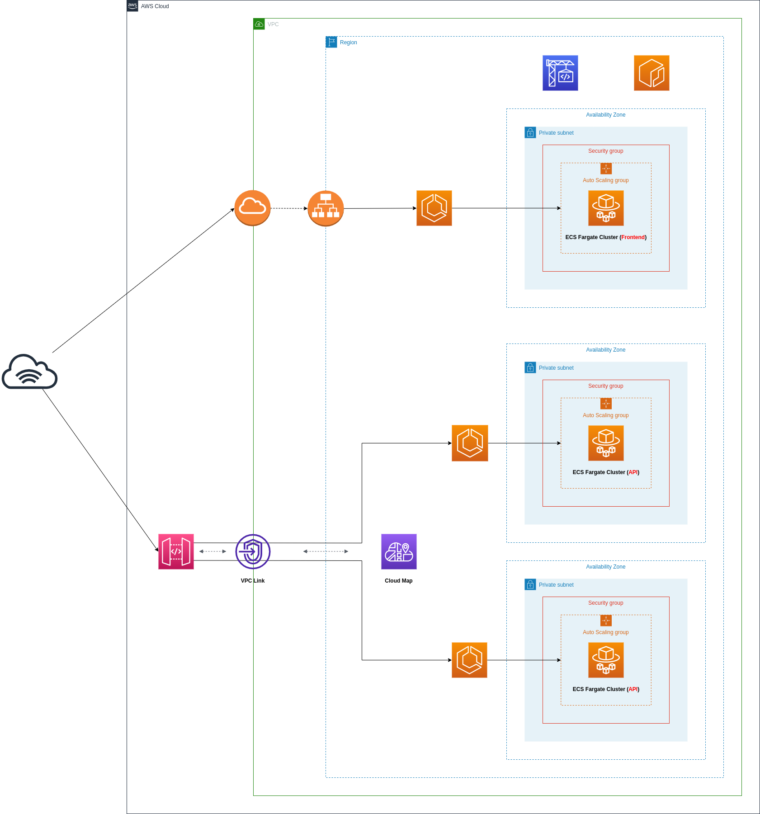

# AWS API Gateway with ECS Fargate Cluster 

This is a demonstration of the capabilities of using the AWS API Gateway to create serverless, container-based APIs using Amazon ECS and Amazon API Gateway.

This demo utilizes sourse code of [this public repo](https://github.com/nurhun/django_rest_framework_movies_apis_w_react_frontend), to view custom modifications to AWS, checkout aws-ecs-and-api-gateway branch.

 

### Architecture Diagram:

 

### Overview:

This example API exposes one service handles both users and movies endpoints.

The following building blocks are used:

**API Gateway HTTP APIs:** for exposing the containerized services to the user. API routes and the respective integrations are defined in API Gateway.
- A **route** is the combination of a path and a method.
- An **integration** is the backend service which is invoked by that route.
- In this API, private integrations point to **AWS Cloud Map** services, which in turn resolve to private Amazon ECS services. As Amazon ECS services are private resources in a Virtual Private Cloud (VPC), API Gateway uses a **VPC link** to connect to them in a private way. A VPC link is a set of elastic network interfaces in the VPC, assigned to and managed by API Gateway, so that API Gateway can talk **privately** with other resources in the VPC. This way, Amazon ECS services can be launched in private subnets and don’t need a public IP. 

**AWS Cloud Map:** for service discovery of the containerized services. 
- API Gateway needs a way to find physical addresses of the backend services, and AWS Cloud Map provides this capability. To enable this functionality, **service discovery** should be configured on Amazon ECS services.
- Amazon ECS performs periodic health checks on tasks in Amazon ECS services and registers the healthy tasks to the respective AWS Cloud Map service. AWS Cloud Map services can then be resolved either via DNS queries or by calling the DiscoverInstances API (API Gateway uses the API).
- AWS Cloud Map supports different DNS record types (including A, AAAA, CNAME, and SRV); API Gateway can only retrieve SRV records from AWS Cloud Map, so SRV records are used in this sample application. With SRV records, each AWS Cloud Map service returns a combination of IP addresses and port numbers of all the healthy tasks in the service.

**Amazon ECS:** for hosting the containerized services. 
- Amazon ECS is a highly scalable and high-performance container orchestrator. The Fargate launch type is used, so that containers are launched on the Fargate serverless compute engine, and you don’t have to provision or manage any EC2 instances.
- Here we have 2 ECS clusters, one for the api service and the other is for the frontend React service.

**Amazon Application LoadBalancer:** for directing incoming traffic to the active **frontend** tasks within an Amazon ECS service, as well as providing a DNS URL.

**Amazon Identity and Access Management (IAM):** for securing access to the resources in the API. IAM policies are used to control access to the resources, including the API Gateway, Amazon ECS, AWS Cloud Map and Secret Manager.

**Amazon CodeBuild:**  for creating and deploying containerized services. After obtaining the API Gateway invocation URL, the React app needs to be built to pass this URL to Axios baseURL.

 

